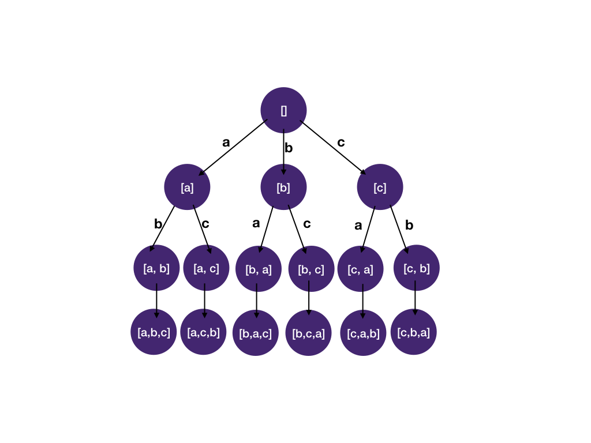
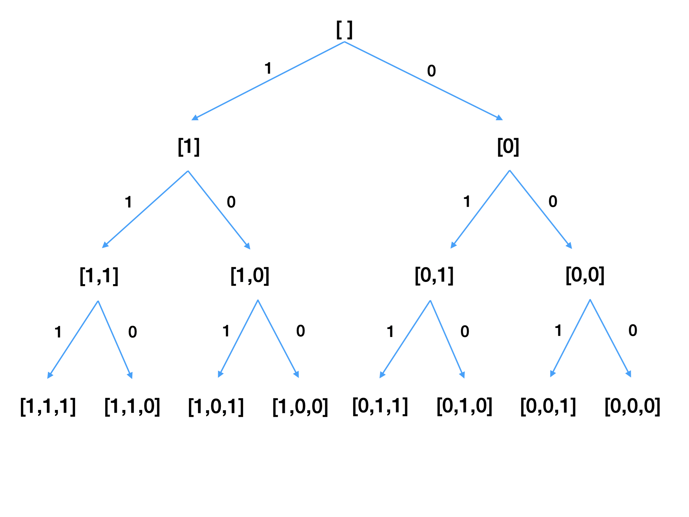

# Math for Technical Interviews
## How much math do I need to know for technical interviews?
The short answer is about high school-level math.

Computer science is often associated with math, and some universities even place their computer science department under the math faculty. However, the reality is that you usually only need high school math for most of the software engineering interviews and day-to-day software engineering jobs.

But I have seen an xxx question on LeetCode that needs a yyy math trick
LeetCode has 2000+ questions, mainly user submitted. Having a particular question in the vast question bank doesn't mean very much. What really matters is whether the question is asked in an actual interview. If you look at the top questions companies ask, the questions that require advanced math tricks or knowledge are rarely asked. Questions that require knowing a particular math trick or fact are a knowledge test, and interviews are supposed to test your coding and problem-solving skills, not specific math knowledge.

What if I'm so unlucky that I got asked a tricky math question?
At most companies, candidates' performance ratings are reviewed by engineers other than the interviewers. And if a question is considered too difficult or off-topic, that round will be considered to carry less significance and assigned less weight in the final decision. So don't sweat about not knowing advanced math.

What if I don't even remember high school math?
You can learn it in one hour. Let's go through them now!

Understanding Number Bases
Before diving into logarithms, it's important to understand the concept of "bases" in mathematics. A base determines the number of unique digits and the value each position in a numeral system represents.

Base 10: We humans naturally count using the decimal (base 10) system, which has ten unique digits: 0 through 9. Think about how you count: after reaching the number 9, we reset to two digits, starting at 10. This pattern continues, with each position from the right representing an increasing power of 10.

For example, in the number 352:

2 is in the ones place (which is 10 ^ 0)
5 is in the tens place (which is 10 ^ 1)
3 is in the hundreds place (which is 10 ^ 2)
Transition to Base 2 in Computer Science: In contrast, computers operate using the binary (base 2) system. This system has only two unique digits: 0 and 1. The reasons for this binary nature are rooted in the on-off, true-false electronic logic of computer circuits. In the binary system, each position from the right represents an increasing power of 2.

In the binary number 1011:

The rightmost 1 is in the "ones" place (which is 2 ^ 0),
The next 1 is in the "twos" place (which is 2 ^ 1),
The 0 indicates no value in the "fours" place (which is 2 ^ 2),
The leftmost 1 is in the "eights" place (which is 2 ^ 3).

## Introduction to Logarithms
What is a Logarithm? A logarithm answers the question: To what power must we raise a certain base to get a number? In simpler terms, it's the inverse of an exponential function.

Exponential Examples with Base 2:

2^2 means 2 multiplied by itself once: 2 * 2 = 4

2^3 means 2 multiplied by itself twice: 2 * 2 * 2 = 8

2^4 means 2 multiplied by itself thrice: 2 * 2 * 2 * 2 = 16

Understanding Logarithms with Base 2: Given a number, the logarithm tells us how many times we need to multiply 2 to obtain that number.

log(8) = 3 means we need three 2's multiplied together to get 8: 2 * 2 * 2

log(16) = 4 means we need four 2's multiplied together to get 16: 2 * 2 * 2 * 2

Alternatively, the logarithm tells us how many times we can divide a number by 2 until we reach 1:

8 / 2 / 2 / 2 = 1 - Dividing 8 by 2 three times gives 1, so log(8) = 3

16 / 2 / 2 / 2 / 2 = 1 - Dividing 16 by 2 four times gives 1, so log(16) = 4

Logarithms, especially with base 2, are fundamental in computer science because many computational problems instinctively split themselves in half.

Permutations and factorial
Sets and Sequences:

Set: A collection of distinct items, referred to as "elements", where the order of the items does not matter. E.g., {a, b}.

Permutation: A specific arrangement or ordering of the elements of a set. In permutations, the order is crucial. For the set {a, b}, we have two permutations: [a, b] and [b, a].

The following figure shows all the permutations of (a, b, c).

### Counting permutations
Imagine arranging three letters: a, b, and c.

For the first position, you have 3 choices (a, b, or c). Once you've chosen the first letter, only 2 remain for the second position. For the third and final position, only 1 letter is left.

This gives a total of 3 * 2 * 1 permutations, or 6 possible sequences: [a, b, c], [a, c, b], [b, a, c], [b, c, a], [c, a, b], and [c, b, a].

We can generalize this idea to count the number of permutations for a set of size n.

For the first position, we have n choices. Once the first position has been fixed, there's n - 1 choices for the second position. Then, we have n - 2 choices for the third position. We'll keep making choices until only 1 letter is left.

From this, we can get that the number of permutations for a set of size n is n * (n-1) * (n-2)... 1. This is called factorial of n, denoted by n!. For example, 5! = 5 * 4 * 3 * 2 * 1 = 120. This means there are 120 ways to arrange 5 letters in a row.

## Understanding Subsets
What is a Subset? A subset of a set A is another set that contains only the elements which are also present in A. For instance, the set {1, 3, 9} is a subset of {1, 2, 3, 5, 6, 7, 9} because every element of the former is present in the latter.

How Many Subsets Can a Set Have? When we look at the elements of a set, for each element, we have a choice:

Include it in the subset
Exclude it from the subset This gives two possibilities for each element.
Here's a figure to illustrate this. Think of it like switches: each element has a switch that can either be "ON" (included in the subset) or "OFF" (excluded from the subset).

With one element (or switch), we have 2 ^ 1 or 2 possible states.
With two elements, we have 2 ^ 2 or 4 possible states.
With three elements, we'll get 2 ^ 3 or 8 possible states.
Expanding on this idea, if a set has n elements, then there will be 2 ^ n subsets. Note that these 2 ^ n subsets include the empty subset (where no elements are chosen) and the original set itself (where all elements are chosen).

## Arithmetic sequence
An arithmetic sequence is a sequence of numbers such that the difference between the consecutive terms is constant. For example,

1 2 3 4 5 is an arithmetic sequence because the difference between consecutive numbers is 1.

1 3 5 7 9 is an arithmetic sequence because the difference between consecutive numbers is 2.

1 2 4 is NOT an arithmetic sequence because 2 - 1 = 1 (first difference) but 4 - 2 = 2 (second difference). Here, the differences between consecutives are different.

Sum of an arithmetic sequence
The sum of an arithmetic sequence is (first_element + last_element) * number_of_element / 2. Here's the animated proof from Wikipedia if you are interested.

For example:

sum([1,2,3,4,5]) = (1 + 5) * 5 / 2 = 15

sum([1,3,5,7,9]) = (1 + 9) * 5 / 2 = 25

Because last_element = first_element + difference * (number_of_element - 1) , the sum can be expressed as (2 * first_element + difference * (number_of_elements - 1)) * number_of_elements / 2). In big O complexity analysis, we drop the constant terms (first_element, difference and -1), so this really becomes O(n^2).

When is arithmetic sequence useful [for my interviews]?
It's sometimes useful for nested loop complexity analysis.

Consider the code below:

n = 10
for (i = 0; i < n; i++) {
for (j = 0; j <= i; j++) {
doSomething();
}
}
How many times does doSomething() run?

It runs 1 time when i = 0

It runs 2 times when i = 1

…

It runs 10 times when i = 9

This is an arithmetic sequence and the total run time is O(n^2).

Geometric sequence
Similar to arithmetic sequence, a geometric sequence is a sequence of numbers such that the ratio between the consecutive terms is constant. For example,

1 2 4 8 16 is a geometric sequence because the ratio between consecutive numbers is 2.

1 3 9 27 81 is a geometric sequence because the ratio between consecutive numbers is 3.

1 2 6 is NOT a geometric sequence because 2 / 1 = 2 but 6 / 2 = 3. Here, the ratio between consecutive elements is different.

The sum of a geometric sequence is first_element * (1 - ratio^number_of_elements) / (1 - ratio).

Geometric sequence is useful in counting the number of nodes in a perfect binary tree. We will cover it in the Everything about trees section.

Modular Arithmetic
Modular arithmetic is a system of integers that “wrap around” when reaching a certain value, called the modulus. If this sounds weird, one example of modular arithmetic you are likely to encounter daily is the clock system.

On a clock, there are 12 hours. With a 24hr system, for each hour greater than 12, we subtract 12 to convert to a 12hr based system. E.g. 15h = 15-12 = 3 o'clock. In math jargon, 15 and 3 are called congruent modulo 12.

In computer programming, % is often used as the modulo symbol in most programming languages.

15 % 12 = 3

This reads 15 MOD 12 is 3.

How to calculate MOD
The rule to calculate x % y is:

if x < y, return x
else subtract y from x until x < y
function mod(x, y) {
while (x >= y) {
x -= y
}
return x
}
For example,

3 % 12 = 3 because 1) above applies.

32 % 12: 32 is greater than 12, so we subtract 12 from it 32-12=20, 20 is still greater than 12, we subtract 12 again and get 8; therefore, we return 8.

The interesting MOD property often used in interview questions is its distributivity:

(a + b) MOD c = ((a MOD c) + (b MOD c)) MOD c

i.e. (the sum of a series of integers) MOD c equals to (the sum of each integer MOD c) MOD c

For example

(13 + 2) MOD 12 = 15 MOD 12 = 3

= ((13 MOD 12) + (2 MOD 12)) MOD 12 = (1 + 2) MOD 12 = 3

When is MOD useful?
You should think about mod when you have a problem that deals with divisibility. Consider this problem:

Given a positive integer n, check if the integer is a prime number.

A prime number is an integer with exactly two distinct divisors, 1 and itself.

Note: 1 is not a prime number because it has exactly one divisor: 1.

The general solution to this classical problem is to check if n is divisible by any integers in the range [2, sqrt(n)].

Checking the range [2, sqrt(n)] instead of the whole range [2, n - 1] works because if a number has more than 2 divisors, it will always have a divisor in the range [2, sqrt(n)].

We can check if n is divisible by an integer x by checking if the expression n % x evaluates to 0.

Example 1: n = 15

We have 15 % 2 = 1 and 15 % 3 = 0. Since 15 % 3 == 0, 15 isn't prime

Example 2: n = 17

We have 17 % 2 = 1, 17 % 3 = 2, and 17 % 4 = 1. Since none of these values evaluated to 0, we can conclude 17 is prime.

That's it, folks/mates/comrades! That's pretty much all the math you need to know. You are now ready to dive into algorithms and data structures.

Reference
https://algo.monster/problems/math-basics